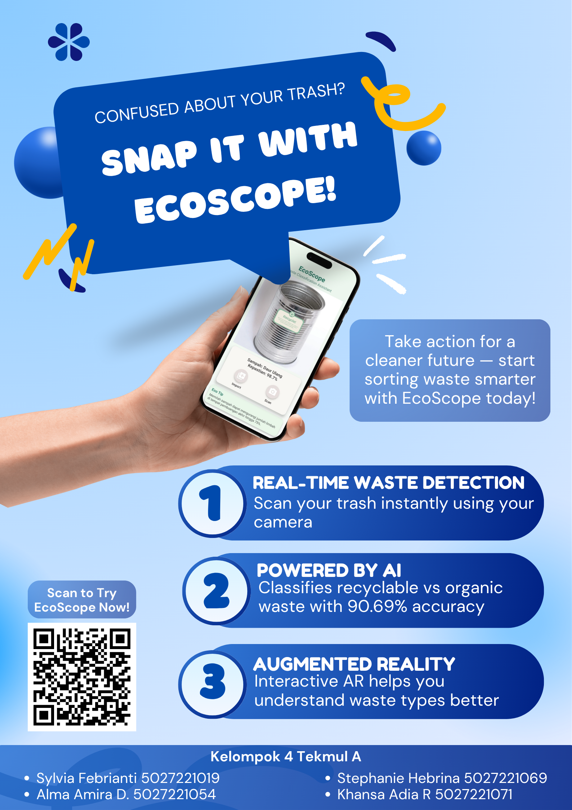
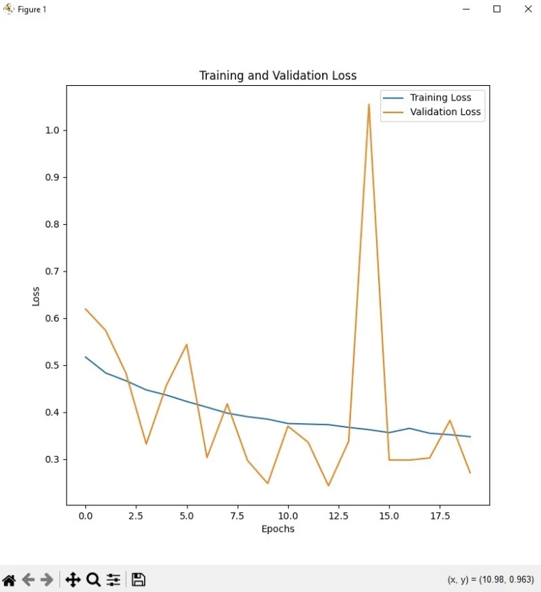
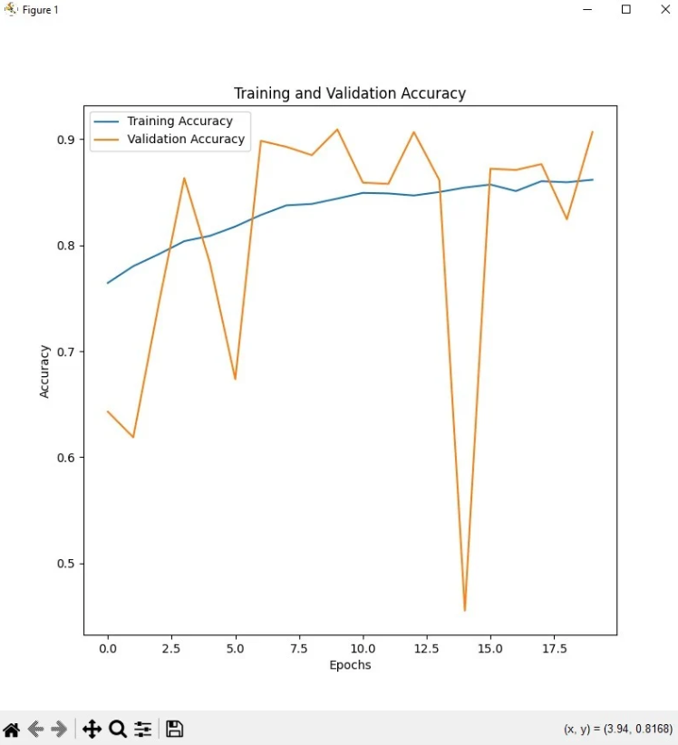
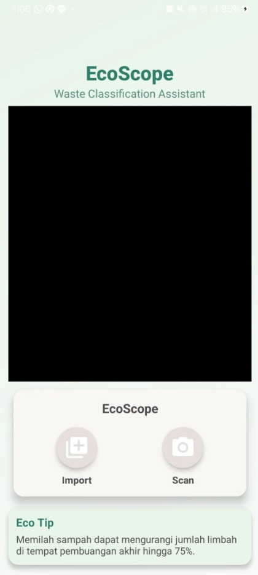
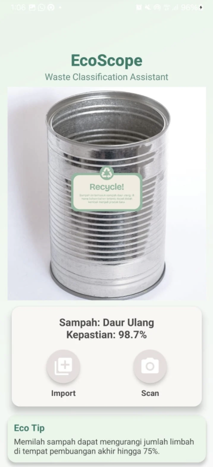
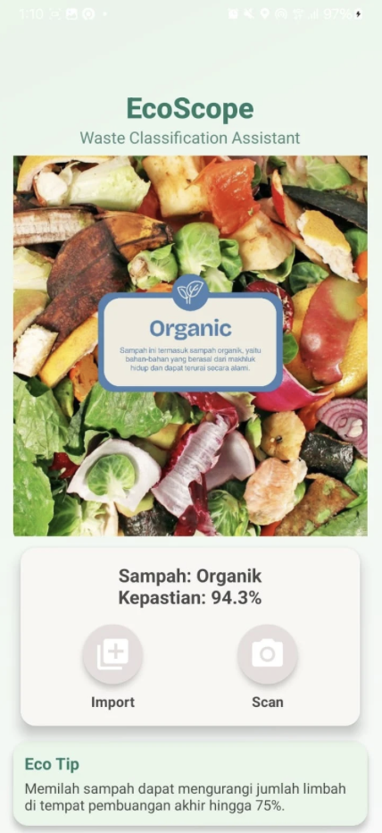
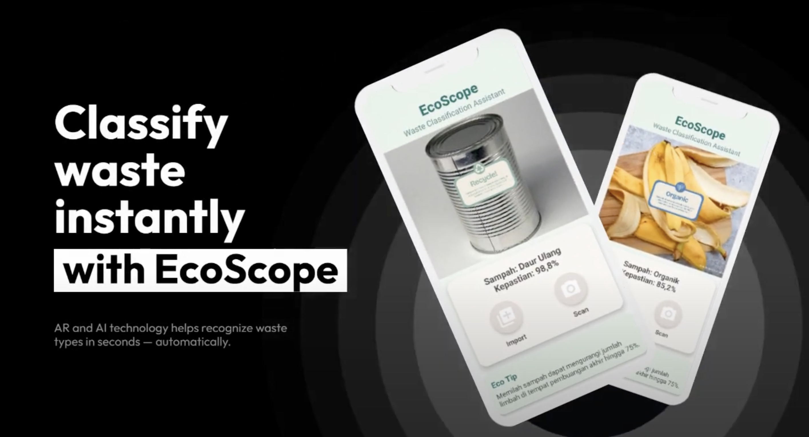

# ecoscope
Aplikasi klasifikasi sampah berbasis kamera dan AR, menggunakan TensorFlow Lite dan CNN + CBAM.

## Apa itu EcoScope?
EcoScope adalah aplikasi untuk membantu pengguna mengklasifikasikan jenis sampah menjadi:
> ♻️ **Recycle**: plastik, botol, kaca
> 🍃 **Organic**: sisa makanan, daun, dll

Memberikan wawasan pengelolaan sampah yang ramah lingkungan secara **real-time** melalui kamera.

## Teknologi yang Digunakan

- TensorFlow Lite
- Convolutional Neural Network (CNN)
- CBAM (Convolutional Block Attention Module)
- Augmentasi data
- Binary Classification

---

## Dataset
Waste Classification Dataset
[Kaggle: Waste Classification Data](https://www.kaggle.com/datasets/techsash/waste-classification-data)
---
## 📈 Hasil Training

### Akurasi Model


### Loss Model


---

## 🔁 Alur Kerja Aplikasi

1. Pengguna membuka aplikasi
2. Mengambil gambar (kamera/galeri)
3. Aplikasi melakukan klasifikasi
4. Hasil klasifikasi ditampilkan
5. Visualisasi AR ditampilkan

---

## 📱 Tampilan UI

### Halaman Home


### Hasil Klasifikasi



---

## Demo Aplikasi
[](https://youtu.be/fIZHUiWRCRI)

---

## Instalasi
Scan QR pada poster di atas atau git clone repo ini
```bash
git clone https://github.com/khansaadiar/ecoscope.git